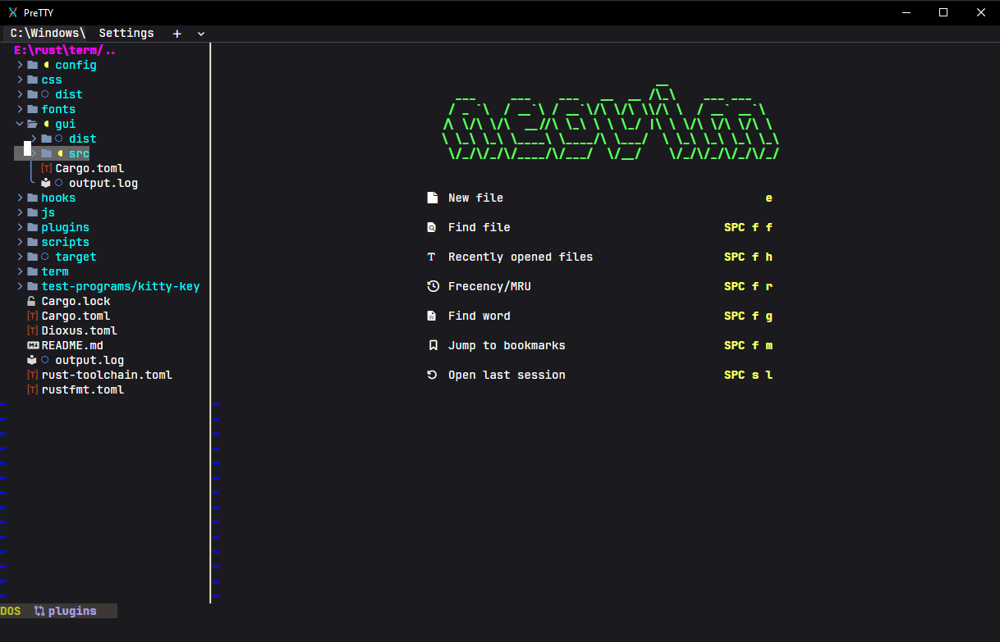
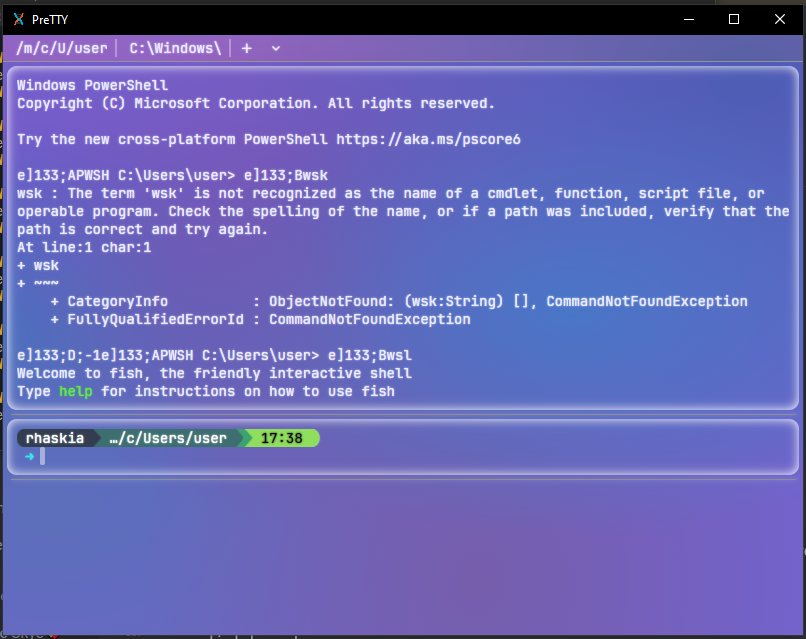

# PreTTY
PreTTY is a fully customizable terminal emulator running off web technologies with the speed of rust (thanks to Dioxus!). PreTTY is designed to be as friendly to new users as possible with comprehensive menus while supporting a completely plain-text-based config. Current features include tabs, keybinding, a command palette, fully-featured settings, and a plugin system currently supporting custom CSS, JS, and palettes. 
|PreTTY running neovim|PreTTY with custom css styling |
|-|-|
|||

# Installation 
`cargo run --release` builds and runs the project, but does not install to the system. You can copy ./target/release/prettyterm_gui into /usr/bin on Linux if you wish to be able to run it from the shell.

## Dependencies 
The main dependency is just a web view to render the app, which is usually these:

Linux: WebkitGtk,

Windows: WebView2 (packaged with Edge),

MacOS: Built-in

You also need libxdo on Linux and a nerd font for the icons to work.

# Contributions
Feel free to contribute anything you want or need out of this! 

# Plugins
To use plugins, either use the plugin manager (not yet containing anything), or copy a plugin you find ([or make!](https://github.com/rhaskia/PreTTYExamplePlugin)) into the config folder for PreTTY.
Future hopes with the plugin system is to also support communication with the terminal itself through js plugins.
